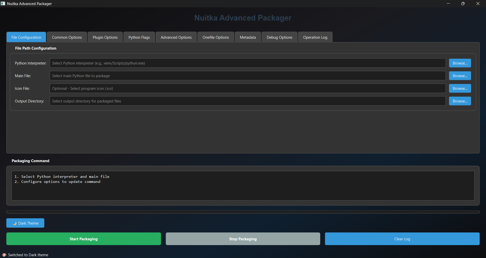

# Nuitka-GUI-Packager - Nuitka GUI Packaging Tool
### Language
* [中文](README_ZH.md)
* [English](README.md)




A GUI packaging tool for Nuitka based on PySide6, simplifying the packaging process for Python applications.

## Features

✅ **Visual Configuration** - Configure Nuitka packaging parameters through an intuitive interface  
✅ **Multi-tab Management** - Organize complex parameters across 8 categorized tabs  
✅ **Real-time Command Generation** - Automatically generates Nuitka commands based on user selections  
✅ **Packaging Process Monitoring** - Real-time display of packaging logs and progress  
✅ **Common Presets** - One-click configuration for frequently used options  
✅ **Plugin Support** - Supports common plugins like PySide6, Tkinter, etc.  
✅ **Metadata Settings** - Set executable file metadata like version information  

## Usage

### Requirements
- Python 3.8+
- Nuitka library
- PySide6 library

### Clone this Repository
```bash
git clone https://github.com/xiaoyingv/Nuitka-GUI-Packager.git
cd Nuitka-GUI-Packager
```

### Install Dependencies (using pip)
```bash
pip install -r requirements.txt
```

### Install Dependencies (using uv)
```bash
uv pip install -r requirements.txt
```

### Run the Program
```bash
python main.py
```

### Packaging Process

1. #### Verify Nuitka Installation
* Ensure Nuitka is installed in the selected Python environment.

2. #### Select Python Interpreter
* Choose the Python interpreter from the environment where the files will be packaged
* Example: C:\Users\install\Python\Python38\Scripts\python.exe

3. #### Select Main File
* Select the entry file of the program to be packaged
* Example: C:\Users\myapp\main.py

4. #### Select Icon File (Optional)
* Choose an icon file, e.g.: C:\Users\myapp\icon.ico
* The packaged executable will display this icon

5. #### Select Output Directory
* Choose output directory, e.g.: C:\Users\myapp\output
* Packaged executables will be saved here

6. #### Configure Common Options
* Select common options in the tabs, e.g.: enable standalone mode, onefile mode, etc.
* Note: Click any parameter option to generate/update the packaging command

7. #### Configure Other Options
* Refer to official documentation for unfamiliar Nuitka parameters
* [Nuitka Official Documentation](https://nuitka.net/user-documentation/)

8. #### Run Packaging
* Click the Run button to start packaging your application

9. #### Packaging Logs
* Packaging logs will display in the log area

10. #### View Packaged Files
* After completion, click "View Packaged Files" in the popup window to access outputs

## License

This project follows the [MIT License](https://opensource.org/licenses/MIT).  
For details, see the [LICENSE](LICENSE) file.