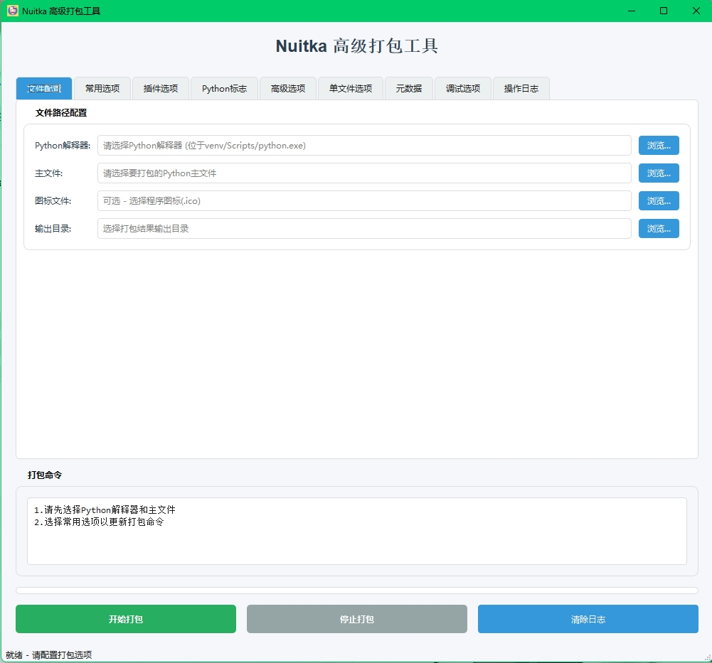

# Nuitka-GUI-Packager - Nuitka 图形化打包工具

### 语言
* [中文](READMI_ZH.md)
* [English](READMI.md)



一个基于 PySide6 开发的 Nuitka 图形化打包工具，简化 Python 应用程序的打包过程。

## 主要功能

✅ **可视化配置** - 通过直观的界面配置 Nuitka 打包参数  
✅ **多标签页管理** - 将复杂参数分类组织在 8 个标签页中  
✅ **实时命令生成** - 根据用户选择自动生成 Nuitka 命令  
✅ **打包过程监控** - 实时显示打包日志和进度  
✅ **常用预设** - 内置常用选项的一键配置  
✅ **插件支持** - 支持 PySide6, Tkinter 等常用插件  
✅ **元数据设置** - 设置可执行文件的版本信息等元数据  
✅ **安全终止** - 支持中途停止打包进程  

## 使用说明

### 运行要求
- Python 3.8+
- Nuitka 库
- PySide6 库
### 克隆这个仓库
```bash
git clone https://github.com/xiaoyingv/Nuitka-GUI-Packager.git
cd Nuitka-GUI-Packager
```

### 安装依赖(使用pip)
```bash
pip install -r requirements.txt
 ```
### 安装依赖(使用uv)
```bash
uv pip install -r requirements.txt
```
### 运行程序
```bash
python main_zh.py
```
### 打包流程

1. #### 检查Nuitka已安装
* 请确保选择的环境 Nuitka 已经安装到运行环境。

2. #### 选择python解释器
* 选择要打包文件python环境中的python解释器
* 例如：C:\Users\install\Python\Python38\Scripts\python.exe

3. #### 选择主文件
选择主文件选择要打包的程序文件入口文件 例如：C:\Users\myapp\main.py

4. #### 选择图标文件(可选)
* 选择图标文件，例如：C:\Users\myapp\icon.ico
* 选择此图标文件后，你的应用打包后的可执行文件将显示此图标

5. #### 选择输出目录
* 选择输出目录，例如：C:\Users\myapp\output
* 输出目录将保存打包后的可执行文件

6. #### 配置常用选项
* 你可以在标签页中选择常用选项，例如：是否使用使用standalone模式打包，是否使用onefile模式打包等
* 注意：你需要先随便点击任意一个选项参数，这样打包命令才能生成或更新

7. #### 配置其他选项
* 如果你不知道nuitka命令参数的含义，你可以去官网查看参数含义
* [nuitka官网文档](https://nuitka.net/user-documentation/)

8. #### 运行打包
* 点击运行按钮，Nuitka-GUI-Packager将开始打包你的程序

9. #### 打包日志
* 打包日志将显示在界面的日志区域

10. #### 查看打包文件
* 打包完成后，你可以点击弹出窗口的打包文件按钮，查看打包后的文件


## 许可证

该项目遵循 [MIT License](https://opensource.org/licenses/MIT) 许可证。  
有关详细信息，请参阅 [LICENSE](LICENSE) 文件。
